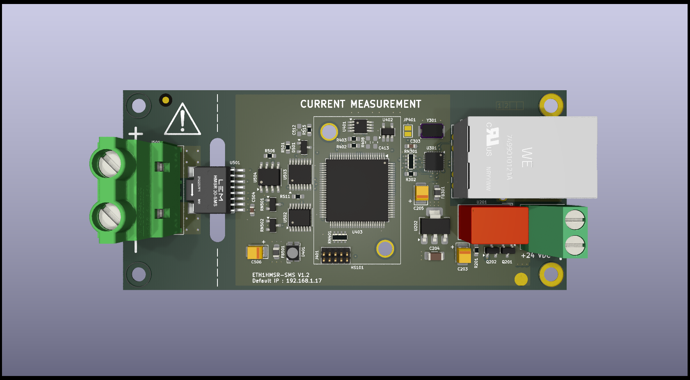

<h1>ETH1HMSR-SMS</h1>

ETH1HMSR-SMS is a one-channel data acquisition card based on the HMSR-SMS chip. The communication with a PC is over Ethernet. The card supports LAN eXtensions for Instrumentation (LXI) and RAW TCP connections.

<h2>FEATURES</h2>

<h3>PCB design</h3>

</img>

<h3>Input current</h3>
The user can mount different HMSR-SMS models for different measurement ranges, those are :

<table align="center">
    <tr>
        <th>Model</th>
        <th>Nominal current (A)</th>
        <th>Measurement range (A)</th>
        <th>Supported</th>
    </tr>
    <tr>
        <td>HMSR6-SMS</td>
        <td>6</td>
        <td>+/- 15</td>
        <td>YES</td>
    </tr>
    <tr>
        <td>HMSR8-SMS</td>
        <td>8</td>
        <td>+/- 20</td>
        <td>YES</td>
    </tr>
    <tr>
        <td>HMSR10-SMS</td>
        <td>10</td>
        <td>+/- 25</td>
        <td>YES</td>
    </tr>
    <tr>
        <td>HMSR15-SMS</td>
        <td>15</td>
        <td>+/- 37.5</td>
        <td>YES</td>
    </tr>
    <tr>
        <td>HMSR20-SMS</td>
        <td>20</td>
        <td>+/- 50</td>
        <td>NO</td>
    </tr>
    <tr>
        <td>HMSR30-SMS</td>
        <td>30</td>
        <td>+/- 75</td>
        <td>
This is some red text.
</td>
    </tr>
</table>

> [!NOTE]
> The limitations is the input connector (Phoenix Contact 1710072) what nominal current is 32 A. For larger current models the user need to redesign the PCB.

<h3>Ethernet connection</h3>