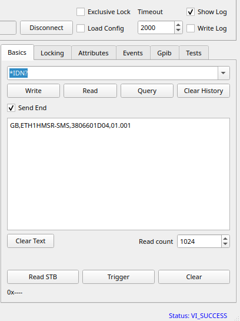
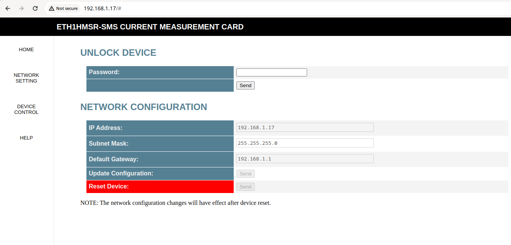
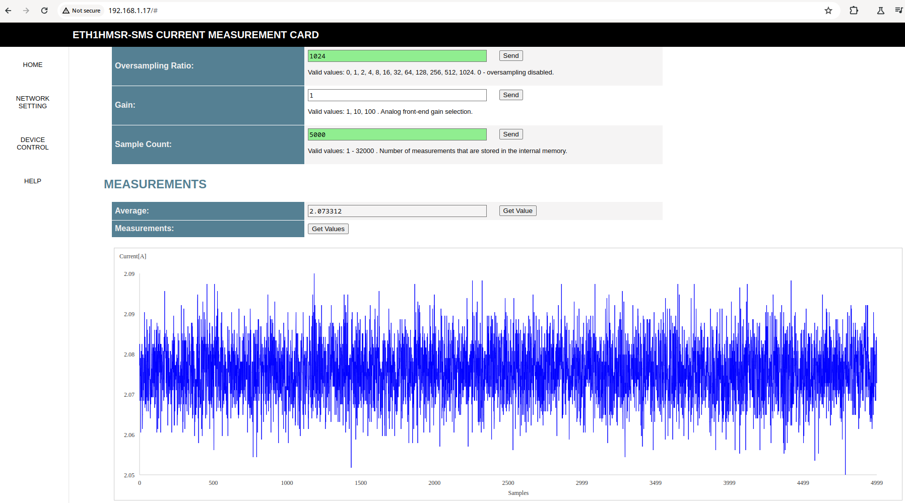
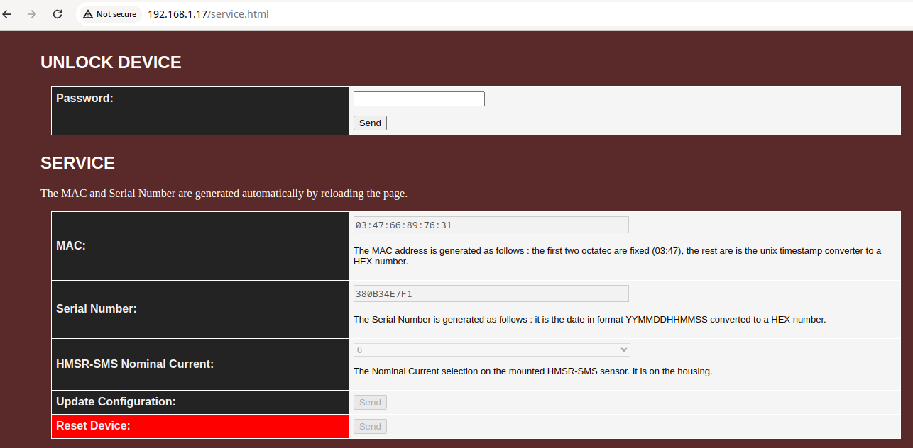

<h1>ETH1HMSR-SMS</h1>

ETH1HMSR-SMS is a one-channel data acquisition card based on the HMSR-SMS chip. The communication with a PC is over Ethernet. The card supports LAN eXtensions for Instrumentation (LXI) and RAW TCP and UDP connections.

<h2>DESCRIPTION</h2>

<h3>Device Design</h3>

Key features of the design include:

<ul>
    <li><b>Dimensions</b>: 100 x 45 mm</li>
    <li><b>Power Supply</b>: Operates on a voltage range from 6.5 to 36 VDC (recommended 24 VDC) and includes reverse voltage protection.</li>
    <li><b>Isolation</b>: The HMSR-SMS chip provides isolation protection for the rest of the circuit.</li>
    <li><b>MCU</b>: STM32H743VITx was selected becaus it large internal FLASH and RAM memories, support for Ethernet and internal 16 bit ADC.</li>
    <li><b>ADC</b>: Internal 16 bit ADC configured in differential mode.</li>
    <li><b>Software</b>: FreeRTOS with lwip and SCPI parser library.</li>
</ul>

3D model rendition for PCB V1.2.

</img>

Below are the images for the PCB V1.0. I made some mistakes, but the botch wires fixed them.

</img>

</img>

</img>

<h3>Input current</h3>

The user can mount different HMSR-SMS models for different measurement ranges, those are :

<table align="center">
    <tr>
        <th>Model</th>
        <th>Nominal current (A)</th>
        <th>Measurement range (A)</th>
        <th>Supported</th>
    </tr>
    <tr>
        <td>HMSR6-SMS</td>
        <td>6</td>
        <td>+/- 15</td>
        <td>YES</td>
    </tr>
    <tr>
        <td>HMSR8-SMS</td>
        <td>8</td>
        <td>+/- 20</td>
        <td>YES</td>
    </tr>
    <tr>
        <td>HMSR10-SMS</td>
        <td>10</td>
        <td>+/- 25</td>
        <td>YES</td>
    </tr>
    <tr>
        <td>HMSR15-SMS</td>
        <td>15</td>
        <td>+/- 37.5</td>
        <td>YES</td>
    </tr>
    <tr>
        <td>HMSR20-SMS</td>
        <td>20</td>
        <td>+/- 50</td>
        <td>NO</td>
    </tr>
    <tr>
        <td>HMSR30-SMS</td>
        <td>30</td>
        <td>+/- 75</td>
        <td>NO</td>
    </tr>
</table>

> [!NOTE]
> The limitations is the input connector (Phoenix Contact 1710072), with nominal current of 32 A. For larger current models the user need to redesign the PCB.

> [!TIP]
> The prototype has a HMSR6-SMS mounted. Other model was not tested.

<h2>Ethernet connection</h2>

The PCB uses Ethernet to communicate with the PC. The features are :

<h3>LAN eXtensions for Instrumentation (LXI)</h3>

> [!WARNING]  
> This device does not guarantee full compliance with the LXI standard. The implementation was based on available documentation and observations of an LXI-compliant device.

<h4>
Device autodetect with multicast DNS (mDNS).
</h4>

</img>

<h4>
Support for High Speed LAN Instrument Protocol (HiSLIP).
</h4>

</img>

<h4>
Web interface
</h4>

The device website provides the ability to obtain device information, make measurements, and configure the device. Additionally, it offers a manual with all SCPI commands.

> [!WARNING]
> The website was tested only with Google Chrome  Browser.

<h5>
Device Home Page
</h5>

</img>

<h5>
Device Network Setup
</h5>

</img>

<h5>
Device Control
</h5>

</img>

<h5>
Device Help
</h5>

</img>

<h5>
Device Service
</h5>

</img>
